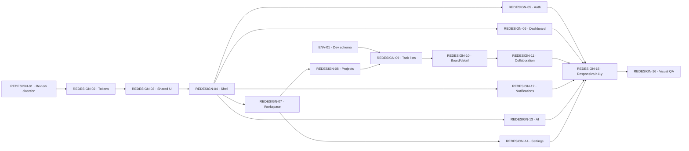

# Task Dependency Graph

```mermaid
flowchart LR
  Approval["REDESIGN-01 · Review direction"] --> R02["REDESIGN-02 · Tokens"] --> R03["REDESIGN-03 · Shared UI"] --> R04["REDESIGN-04 · Shell"]
  ENV["ENV-01 · Dev schema"] --> R09["REDESIGN-09 · Task lists"]
  R04 --> R05["REDESIGN-05 · Auth"]
  R04 --> R06["REDESIGN-06 · Dashboard"]
  R04 --> R07["REDESIGN-07 · Workspace"] --> R08["REDESIGN-08 · Projects"] --> R09 --> R10["REDESIGN-10 · Board/detail"] --> R11["REDESIGN-11 · Collaboration"]
  R04 --> R12["REDESIGN-12 · Notifications"]
  R04 --> R13["REDESIGN-13 · AI"]
  R07 --> R14["REDESIGN-14 · Settings"]
  R05 & R06 & R11 & R12 & R13 & R14 --> R15["REDESIGN-15 · Responsive/a11y"]
  R15 --> R16["REDESIGN-16 · Visual QA"]
```

ENV-01 có thể thực hiện độc lập sau khi phê duyệt môi trường. Thứ tự quản lý theo [Sprint Backlog](README.md). Dependency bắc cầu giữ thứ tự kiểm thử toàn app.
